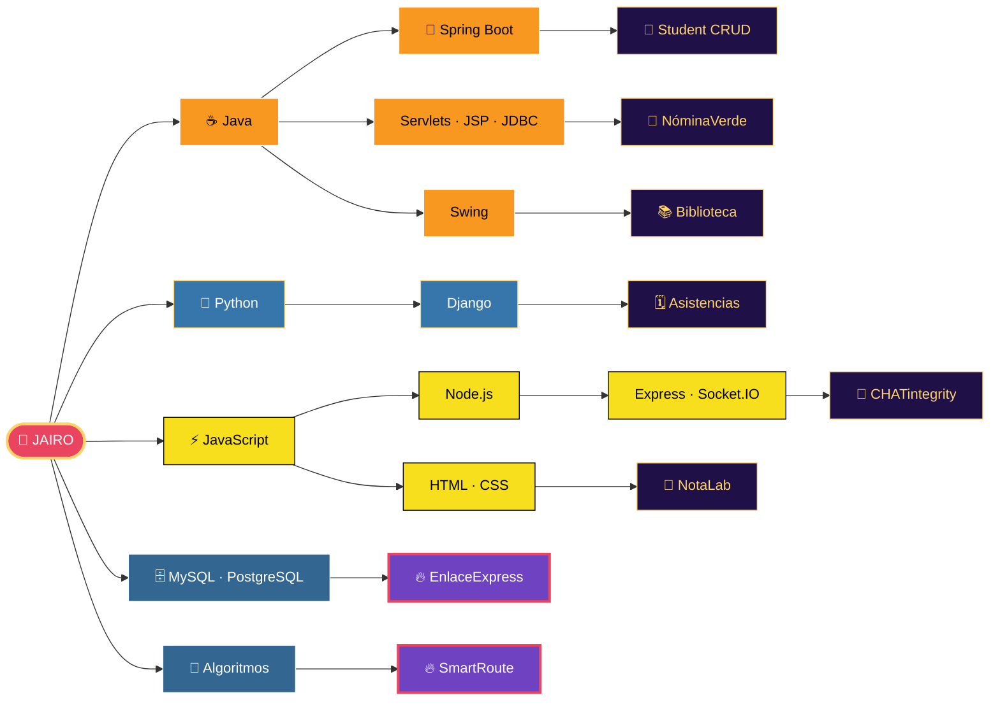

<div align="center">


<a href="https://github.com/JairoVaron">
  
</a>

<br><br>

<a href="https://jairodev-portafolio.netlify.app/"></a>
<a href="https://www.linkedin.com/in/jairo-de-jesus-var%C3%B3n-hern%C3%A1ndez-590648323/"></a>
<a href="https://github.com/JairoVaron"></a>


</div>

<br>

## 🧙 Hoja de personaje

```text
╔══════════════════════════════════════════════════════╗
║  NOMBRE : Jairo Varón                                ║
║  CLASE  : Mago del Backend (Java / Python / Node)    ║
║  NIVEL  : Estudiante de Ingeniería de Sistemas       ║
║  ARMA   : VS Code +5                                 ║
║  MASCOTA: Un bug que nunca se va 🐛                   ║
╠══════════════════════════════════════════════════════╣
║  ❤️  HP  ████████████████░░░░  cafeína al 80%        ║
║  🔮 MP  ██████████████████░░  ganas de aprender      ║
║  ⚔️  ATK ███████████████░░░░░  Java & Spring Boot    ║
║  🛡️  DEF ██████████████░░░░░░  Bases de datos        ║
║  ⚡ SPD ████████████████░░░░  Node.js & Express      ║
║  🐍 INT ███████████████░░░░░  Python & Django        ║
╚══════════════════════════════════════════════════════╝
```

<br>

## 🌳 Árbol de habilidades



<sub>🟡 Nodos dorados = misiones completadas · 🟣 Nodos morados = jefes finales en progreso</sub>

<br>

## 🎒 Inventario

<div align="center">


</div>

<br>

## 📜 Diario de misiones

<div align="center">

<a href="https://github.com/JairoVaron/CHATintegrity"></a>
<a href="https://github.com/JairoVaron/springboot-student-crud"></a>
<a href="https://github.com/JairoVaron/asistencia_docente_"></a>
<a href="https://github.com/JairoVaron/sistema-gestion-empleados-java-web"></a>
<a href="https://github.com/JairoVaron/Sistema-de-Gesti-n-de-Biblioteca---JAVA"></a>
<a href="https://github.com/JairoVaron/Calculadora-de-Notas"></a>

</div>

<details>
<summary><b>🗺️ Ver el detalle de cada misión</b></summary>

<br>

| Misión | Descripción | Botín (tecnologías) |
|---|---|---|
| 💬 **CHATintegrity** | Comunicación empresarial en tiempo real | `Node.js` `Express.js` `Socket.IO` `PostgreSQL` |
| 📘 **Student CRUD** | Gestión de estudiantes | `Java` `Spring Boot` `JPA` `MySQL` |
| 🗓️ **Gestión de Asistencias** | Docentes y asistencias | `Python` `Django` `MySQL` |
| 🌿 **NóminaVerde** | Gestión de empleados | `Java` `Servlets` `JSP` `JDBC` `MySQL` |
| 📚 **Biblioteca** | Gestión de libros (escritorio) | `Java` `Swing` `NetBeans` |
| 🧮 **NotaLab** | Calculadora de notas y proyección académica | `HTML` `CSS` `JavaScript` |

</details>

<br>

## 👹 Jefes finales en progreso

<div align="center">

<table>
<tr>
<td align="center" width="50%">

### 🔥 EnlaceExpress
**Tipo:** Jefe de Bases de Datos<br>
**Debilidad:** Consultas bien indexadas<br>
<br>


</td>
<td align="center" width="50%">

### 🔥 SmartRoute
**Tipo:** Jefe de Optimización<br>
**Debilidad:** Buenos algoritmos<br>
<br>


</td>
</tr>
</table>

</div>

<br>

## 🏅 Logros desbloqueados

<div align="center">


</div>

<br>

## 📊 Estadísticas de batalla

<div align="center">


<br><br>


<br><br>


</div>

<br>

## 🐍 Mini-juego: Snake

<div align="center">

<!-- Requiere el workflow .github/workflows/snake.yml y que este repo se llame JairoVaron/JairoVaron -->
<picture>
  <source media="(prefers-color-scheme: dark)" srcset="https://raw.githubusercontent.com/JairoVaron/JairoVaron/output/github-snake-dark.svg"/>
  
</picture>

</div>

<br>

## 📡 Canal de comunicación

<div align="center">

<a href="https://jairodev-portafolio.netlify.app/"></a>
<a href="https://www.linkedin.com/in/jairo-de-jesus-var%C3%B3n-hern%C3%A1ndez-590648323/"></a>
<a href="https://github.com/JairoVaron"></a>

<br><br>

<a href="https://github.com/JairoVaron">
  
</a>

</div>


